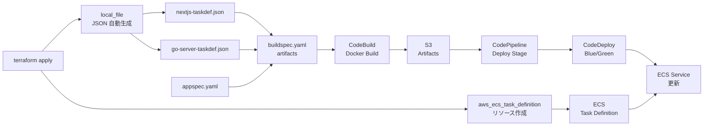

# Task Definition 完全重複排除 - Terraform 自動生成で Single Source of Truth を完全実現

## 概要
Terraform の `aws_ecs_task_definition` と手動 JSON ファイルの重複を完全に排除しました。Terraform の `local_file` リソースを唯一のソースとし、`terraform apply` 実行時に自動生成される仕組みを実現しました。

## 🔴 修正前の課題

### 3つの管理層の重複
```
1. terraform/modules/compute/ecs/main.tf
   ├─ aws_ecs_task_definition.nextjs (Terraform)
   └─ aws_ecs_task_definition.go_server (Terraform)

2. nextjs-taskdef.json (手動ファイル)
   └─ ハードコード値で管理

3. go-server-taskdef.json (手動ファイル)
   └─ ハードコード値で管理
```

**問題：**
- ❌ 同じ情報を複数の場所で管理
- ❌ Terraform の値と JSON ファイルの同期が必要
- ❌ 環境変更時に全て修正する必要がある
- ❌ Single Source of Truth がない

## ✅ 修正内容

### 1. 手動 JSON ファイルを削除 🗑️
```bash
# 削除されたファイル
nextjs-taskdef.json       # ← 削除
go-server-taskdef.json    # ← 削除
```

### 2. Terraform local_file で自動生成
```terraform
# terraform/modules/compute/ecs/main.tf

resource "local_file" "nextjs_taskdef_json" {
  filename = "${path.root}/nextjs-taskdef.json"
  content = jsonencode({
    family                   = aws_ecs_task_definition.nextjs.family
    networkMode              = "awsvpc"
    requiresCompatibilities  = ["FARGATE"]
    cpu                      = tostring(var.nextjs_task_cpu)
    memory                   = tostring(var.nextjs_task_memory)
    containerDefinitions = [
      {
        name      = "${var.project_name}-nextjs"
        image     = "<IMAGE1_NAME>"  # CodePipeline が置換
        essential = true
        portMappings = [...]
        logConfiguration = {...}
      }
    ]
  })
}

resource "local_file" "go_server_taskdef_json" {
  filename = "${path.root}/go-server-taskdef.json"
  content = jsonencode({
    # Go Server の Task Definition
  })
}
```

**メリット：**
- ✅ Terraform が唯一のソース
- ✅ `terraform apply` で自動生成
- ✅ 環境に応じた動的な値を反映
- ✅ 変更は Terraform のみ

### 3. buildspec.yaml の artifacts セクションは変更なし
```yaml
artifacts:
  files:
    - appspec.yaml
    - nextjs-taskdef.json       # terraform apply で生成される
    - go-server-taskdef.json    # terraform apply で生成される
```

**流れ：**
```
1. terraform apply
   ↓
2. local_file で JSON を自動生成
   ├─ nextjs-taskdef.json
   └─ go-server-taskdef.json
   ↓
3. これらのファイルが buildspec.yaml で参照される
   ↓
4. CodeBuild のアーティファクトとして S3 へ
   ↓
5. CodeDeploy が Deploy Stage で使用
```

## 📊 修正の全体像

| レイヤー | 修正前 | 修正後 |
|---------|--------|--------|
| **Terraform** | Task Definition のみ | + local_file で自動生成 ✅ |
| **手動JSON** | nextjs-taskdef.json | 削除 🗑️ |
| | go-server-taskdef.json | 削除 🗑️ |
| **buildspec.yaml** | 参照定義のみ | 変更なし ✅ |
| **ソース** | 分散（重複） | 一元化 ✅ |

## 🎯 Single Source of Truth の完全実現

### 修正前
```
ECS Task Definition を更新する場合:

1. terraform/modules/compute/ecs/main.tf を編集
   ↓
2. nextjs-taskdef.json も編集
   ↓
3. go-server-taskdef.json も編集
   ↓
4. 3つ全てを git add & commit

❌ 1つの概念が3つに分散
❌ 同期ズレのリスク
❌ 変更追跡が複雑
```

### 修正後
```
ECS Task Definition を更新する場合:

1. terraform/modules/compute/ecs/main.tf のみ編集
   ↓
2. terraform apply 実行
   ↓
3. JSON ファイルが自動生成される
   ↓
4. 1つのコミットで完結

✅ Single Source of Truth
✅ 自動同期
✅ 変更追跡が明確
```

## ✨ デプロイフロー（最終版）



## 🔄 実装の詳細

### local_file リソースの動作

**Terraform が行うこと：**
1. `aws_ecs_task_definition` で ECS に Task Definition を登録
2. `local_file` で JSON ファイルを自動生成
3. JSON には Terraform の値を動的に埋め込む

**JSON に含まれる値：**
```json
{
  "family": "ecs-sample-nextjs",           // Terraform から参照
  "cpu": "256",                             // 変数から参照
  "memory": "512",                          // 変数から参照
  "containerDefinitions": [
    {
      "logConfiguration": {
        "options": {
          "awslogs-group": "/ecs/ecs-sample-nextjs"  // CloudWatch ロググループ名
        }
      }
    }
  ]
}
```

### buildspec.yaml の artifacts セクション

```yaml
artifacts:
  files:
    - appspec.yaml              # Git から取得
    - nextjs-taskdef.json       # terraform apply で生成
    - go-server-taskdef.json    # terraform apply で生成
```

**実行順序：**
```
1. GitHub チェックアウト
   ├─ appspec.yaml を取得
   └─ buildspec.yaml を実行

2. buildspec.yaml 実行
   ├─ Docker イメージ ビルド＆ECR Push
   └─ artifacts セクション
        ├─ appspec.yaml を S3 へ
        ├─ nextjs-taskdef.json を S3 へ
        └─ go-server-taskdef.json を S3 へ
```

## 🎯 JSON ファイルのライフサイクル

| イベント | JSON ファイルの状態 |
|---------|------------------|
| `terraform apply` 実行 | 自動生成される ✅ |
| ファイル変更なし | terraform plan で "no changes" |
| JSON 内容の更新 | Terraform 変数変更時に自動更新 |
| Git コミット | JSON も含める（自動生成ファイル） |
| `terraform destroy` | JSON は削除されない（安全性） |

## ⚠️ 重要な注意事項

### 1. <IMAGE1_NAME> プレースホルダ
```json
{
  "containerDefinitions": [
    {
      "image": "<IMAGE1_NAME>"  // CodePipeline が実行時に置換
    }
  ]
}
```

- Terraform では実行時のイメージ URI を知ることができない
- CodePipeline が実行時に置換する仕組み

### 2. JSON は generated file
```bash
# Git で管理される（生成済みファイル）
git status
# nextjs-taskdef.json と go-server-taskdef.json が表示される

# .gitignore に入らない（必須ファイル）
cat .gitignore | grep taskdef.json
# 何も出力されない（管理対象）
```

### 3. Terraform と JSON の同期
```bash
# Terraform 変数を変更
vi terraform/variables.tf

# apply で JSON も同時に更新
terraform apply

# JSON が更新されたか確認
git diff nextjs-taskdef.json
```

## 🔍 確認手順

### 1. Terraform 実行後の確認
```bash
# ファイルが生成されているか確認
ls -la nextjs-taskdef.json go-server-taskdef.json

# JSON の内容確認
cat nextjs-taskdef.json | jq .

# 動的値が正しく埋め込まれているか確認
cat nextjs-taskdef.json | jq '.cpu, .memory, .family'
```

### 2. Git の確認
```bash
# JSON ファイルが tracked か確認
git status

# ファイルの履歴確認
git log --oneline nextjs-taskdef.json

# 過去の変更を確認
git show HEAD:nextjs-taskdef.json | jq .
```

### 3. 構文チェック
```bash
# JSON が有効か確認
jq . nextjs-taskdef.json > /dev/null && echo "Valid JSON"

# AppSpec と Task Definition の関連性確認
cat appspec.yaml | grep -i taskdef
```

## 関連ファイル

**修正されたファイル:**
- `terraform/modules/compute/ecs/main.tf` - `local_file` リソース追加

**削除されたファイル:**
- ~~nextjs-taskdef.json~~ 🗑️
- ~~go-server-taskdef.json~~ 🗑️

**参照するファイル:**
- `buildspec.yaml` - artifacts セクションで参照
- `appspec.yaml` - CodeDeploy 設定

**管理対象ファイル:**
- `nextjs-taskdef.json` - Terraform から自動生成（Git 管理）
- `go-server-taskdef.json` - Terraform から自動生成（Git 管理）

## 次のステップ

✅ **実施済み:**
1. 手動 JSON ファイルを削除
2. Terraform local_file で自動生成に統一
3. Single Source of Truth を完全実現

⏳ **確認作業:**
1. `terraform plan` で出力内容確認
2. `terraform apply` で JSON ファイル生成確認
3. `git status` で生成されたファイル確認
4. JSON 構文チェック
5. buildspec.yaml の artifacts 確認
6. CodeBuild ビルド実行
7. CodeDeploy デプロイメント実行

💡 **運用方針:**
- ECS Task Definition の変更は Terraform のみで行う
- JSON ファイルは手動編集不可
- `terraform apply` で常に最新の JSON が生成される
- Git で変更履歴を一元管理
